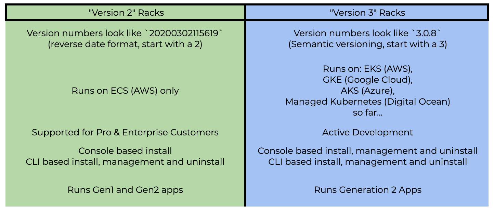

# Version 2 Racks

## Version 2 vs Version 3 Racks

## Documentation

Documentation for our ECS-based, Version 2 platform can be found [here](https://docsv2.convox.com/).  Version 2 is supported for our Pro and Enterprise customers.

## Installing Version 2 CLI

You can install the Version 2 CLI alongside the most recent CLI.  It is suggested to rename the v2 CLI to keep it distinct.  Therefore commands referencing `convox` in the v2 documenation should be replaced with `convox2` based on our suggested renaming here.

### OS X

    $ curl -L https://convox.com/cli/macos/convox -o /tmp/convox2
    $ sudo mv /tmp/convox2 /usr/local/bin/convox2
    $ sudo chmod 755 /usr/local/bin/convox2

### Linux

    $ curl -L https://convox.com/cli/linux/convox -o /tmp/convox2
    $ sudo mv /tmp/convox2 /usr/local/bin/convox2
    $ sudo chmod 755 /usr/local/bin/convox2

### Windows

    $ curl -L https://convox.com/cli/windows/convox.exe -O -o convox2.exe

## Installing Version 2 Racks

Version 2 Racks are still available to install from the Console via the AWS integration.  Choose an 'ECS-based' rack from the drop-down when installing.
Alternatively you can use the v2 CLI to install a v2 Rack: `convox2 rack install aws -n {RACK_NAME}`.

## Managing Version 2 Racks

You can use the v2 CLI to update your v2 Rack and their parameters:

    $ convox2 rack update -r {RACK_NAME}
    $ convox2 rack params set Autoscale=Yes InstanceType=m5.large -r {RACK_NAME}

## Uninstalling Version 2 Racks

You must use the v2 CLI to uninstall a v2 Rack.  This will not be available via the Console.

    $ convox2 rack uninstall aws {RACK_NAME}
